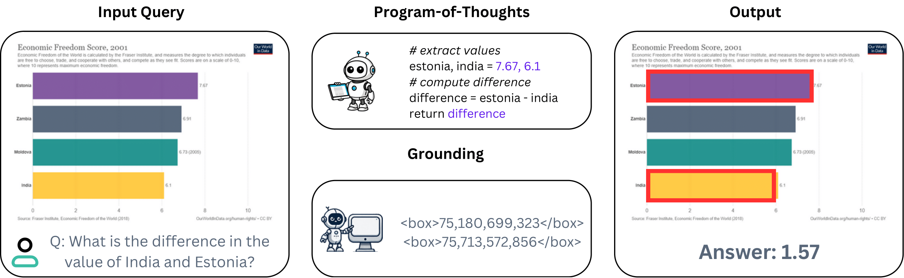
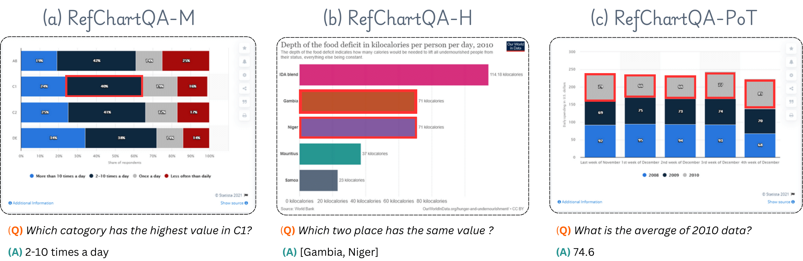

<h1 align="center">📊 RefChartQA: Grounding Visual Answer on Chart Images</h1>

<p align="center">
  <a href="https://huggingface.co/datasets/omoured/RefChartQA">
    
  </a>
  &nbsp;
  <a href="https://arxiv.org/abs/your_paper_id_here">
    
  </a>
</p>

<p align="center">
  
</p>


## 🧠 About

**RefChartQA** is a large-scale benchmark for **visual grounding in chart-based question answering**. It extends the ChartQA and TinyChart-PoT datasets by adding explicit bounding box annotations that link each answer to supporting visual elements in the chart. RefChartQA contains **73,702 annotated samples**, including:
- **55,789** training,
- **6,223** validation,
- **11,690** testing instances.

<p align="center">
  
</p>

## ✅ To-Do

- [x] [March 28, 2025] Upload dataset to Hugging Face 🤗  
- [ ] Release evaluation scripts.
- [ ] Add visualization tools for bounding box inspection.

## 🛠️ Usage

### 📦 Environment Setup

Make sure you have Python installed, then install the required libraries:

```python
pip install datasets pillow
```

### 📂 Load the Dataset

```python
from datasets import load_dataset

dataset = load_dataset("omoured/RefChartQA")

# Print dataset splits and one example
print(dataset)
print(dataset["train"][0])
```

## 📚 Citation
```bibtex
@misc{x}
